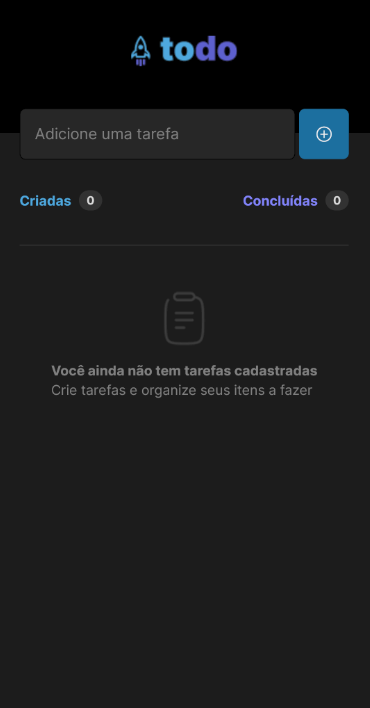
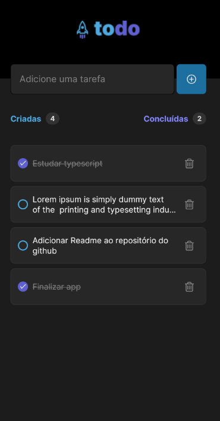

# 💻 Sobre o projeto
Todo App foi desenvolvido para resolução do desafio da trilha de React Native do Ignite. Essa é uma aplicação de controle de tarefas (to-do list), no qual é possível criar e excluir uma tarefa, além de marcar uma tarefa como concluída.

# Funcionalidades
- Adicionar uma nova tarefa
- Marcar uma tarefa como concluída
- Remover uma tarefa da listagem
- Mostrar progresso de conclusão das tarefas

# 🎨 Layout
<div>
    
     
<div>

# 🔨 Tecnologias utilizadas
- ReactNative
- TypeScript

# 🚀 Executando o projeto
Instale as dependências usando o **npm install**. Em seguida, inicie o projeto.
```bash
    # Instalando as dependências
    npm install

    # Execute a aplicação
    npx expo start
```
